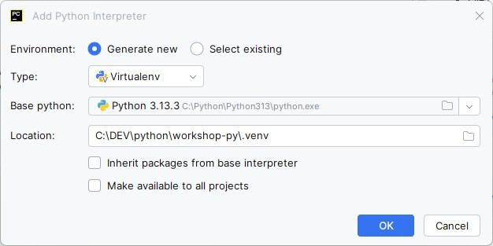

# Python AI tutorials (zola8)

## Getting Started

The first step is to set up your development environment.

Choose your preferred IDE: **PyCharm**, **IntelliJ**, or **VS Code**.  
This guide focuses on **PyCharm**, which we recommend for the best experience.


### Requirements

- [Python][python] (**3.13.3** recommended)  
- [PyCharm][pycharm] IDE  
- [Git][git] (**2.40+** recommended)  
- [Ollama][ollama] for running local LLMs  

[python]: https://www.python.org/downloads/  
[pycharm]: https://www.jetbrains.com/pycharm/  
[git]: https://git-scm.com/downloads  
[ollama]: https://ollama.com/download  

### Setup

#### 1. Create a Python Virtual Environment

##### Option A: Using PyCharm (Recommended)

1. Open **File → Settings → Project: `workshop-py` → Python Interpreter → Add Interpreter → Add Local Interpreter**  
2. Select **Virtualenv Environment** and set the location to `.venv` inside your project directory.



##### Option B: Using the Command Line

If you prefer working from the terminal, create the environment manually:

**Windows**
```shell
python -m venv .venv
.\.venv\Scripts\activate.bat
```

**macOS / Linux**
```shell
python3 -m venv .venv
chmod -R 777 .venv
source .venv/bin/activate
```

#### 2. Set Up Ollama

##### Windows

1. Install Ollama from the [official site][ollama] and ensure the service is running.  
2. Download the required models:
```shell
ollama pull llama3.2
ollama pull mxbai-embed-large
```
3. Verify the downloads:
```shell
ollama list
```

##### macOS

1. *(Optional)* Install Homebrew if it isn’t already installed:
```shell
/bin/bash -c "$(curl -fsSL https://raw.githubusercontent.com/Homebrew/install/HEAD/install.sh)"
```
2. Install Ollama:
```shell
brew install ollama
```
3. Start the Ollama service (leave this terminal open):
```shell
ollama start
```
4. In a **new terminal window**, download the models:
```shell
ollama pull llama3.2
ollama pull mxbai-embed-large
```
5. Confirm the models are available:
```shell
ollama list
```

## Running the Application

Install dependencies:
```shell
pip install -r requirements.txt
```
